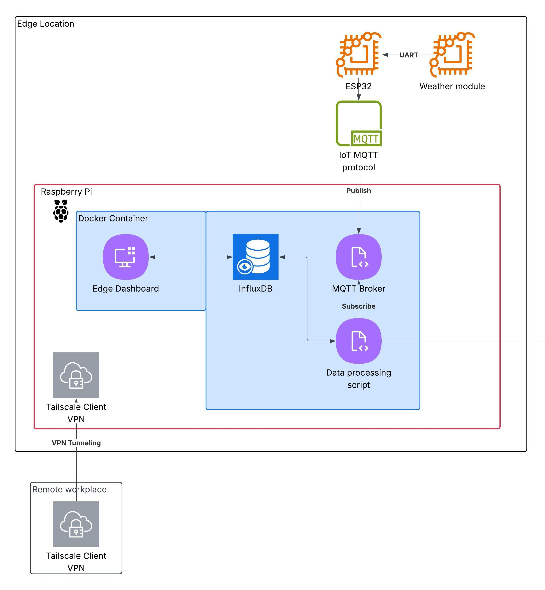
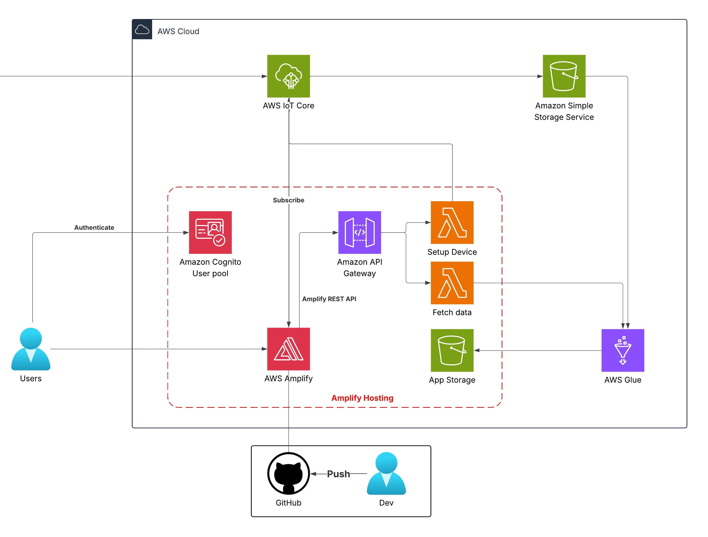

# IoT Weather Platform for Lab Research
## A Unified AWS Serverless Solution for Real-Time Weather Monitoring

### 1. Executive Summary
The IoT Weather Platform is designed for the ITea Lab team in Ho Chi Minh City to enhance weather data collection and analysis. It supports up to 5 weather stations, with potential scalability to 10-15, utilizing Raspberry Pi edge devices with ESP32 sensors to transmit data via MQTT. The platform leverages AWS Serverless services to deliver real-time monitoring, predictive analytics, and cost efficiency, with access restricted to 5 lab members via Amazon Cognito.

### 2. Problem Statement
### What’s the Problem?
Current weather stations require manual data collection, becoming unmanageable with multiple units. There is no centralized system for real-time data or analytics, and third-party platforms are costly and overly complex.

### The Solution
The platform uses AWS IoT Core to ingest MQTT data, AWS Lambda and API Gateway for processing, Amazon S3 for storage (including a data lake), and AWS Glue Crawlers and ETL jobs to extract, transform, and load data from the S3 data lake to another S3 bucket for analysis. AWS Amplify with Next.js provides the web interface, and Amazon Cognito ensures secure access. Similar to Thingsboard and CoreIoT, users can register new devices and manage connections, though this platform operates on a smaller scale and is designed for private use. Key features include real-time dashboards, trend analysis, and low operational costs.

### Benefits and Return on Investment
The solution establishes a foundational resource for lab members to develop a larger IoT platform, serving as a study resource, and provides a data foundation for AI enthusiasts for model training or analysis. It reduces manual reporting for each station via a centralized platform, simplifying management and maintenance, and improves data reliability. Monthly costs are $0.66 USD per the AWS Pricing Calculator, with a 12-month total of $7.92 USD. All IoT equipment costs are covered by the existing weather station setup, eliminating additional development expenses. The break-even period of 6-12 months is achieved through significant time savings from reduced manual work.

### 3. Solution Architecture
The platform employs a serverless AWS architecture to manage data from 5 Raspberry Pi-based stations, scalable to 15. Data is ingested via AWS IoT Core, stored in an S3 data lake, and processed by AWS Glue Crawlers and ETL jobs to transform and load it into another S3 bucket for analysis. Lambda and API Gateway handle additional processing, while Amplify with Next.js hosts the dashboard, secured by Cognito. The architecture is detailed below:

### AWS Services Used
- **AWS IoT Core**: Ingests MQTT data from 5 stations, scalable to 15.
- **AWS Lambda**: Processes data and triggers Glue jobs (two functions).
- **Amazon API Gateway**: Facilitates web app communication.
- **Amazon S3**: Stores raw data in a data lake and processed outputs (two buckets).
- **AWS Glue**: Crawlers catalog data, and ETL jobs transform and load it.
- **AWS Amplify**: Hosts the Next.js web interface.
- **Amazon Cognito**: Secures access for 5 users.

### Component Design
- **Edge Devices**: Raspberry Pi collects and filters sensor data, sending it to IoT Core.
- **Data Ingestion**: AWS IoT Core receives MQTT messages from the edge devices.
- **Data Storage**: Raw data is stored in an S3 data lake; processed data is stored in another S3 bucket.
- **Data Processing**: AWS Glue Crawlers catalog the data, and ETL jobs transform it for analysis.
- **Web Interface**: AWS Amplify hosts a Next.js app for real-time dashboards and analytics.
- **User Management**: Amazon Cognito manages user access, allowing up to 5 active accounts.

### 4. Technical Implementation
**Implementation Phases**
This project has two parts—setting up weather edge stations and building the weather platform—each following 4 phases:
- Build Theory and Draw Architecture: Research Raspberry Pi setup with ESP32 sensors and design the AWS serverless architecture (1 month pre-internship). Use the diagram in Appendix C as a guide.
- Calculate Price and Check Practicality: Use AWS Pricing Calculator to estimate costs and adjust if needed (Month 1).
- Fix Architecture for Cost or Solution Fit: Tweak the design (e.g., optimize Lambda with Next.js) to stay cost-effective and usable (Month 2).
- Develop, Test, and Deploy: Code the Raspberry Pi setup, AWS services with CDK/SDK, and Next.js app, then test and release to production (Months 2-3).

**Technical Requirements**
- Weather Edge Station: Sensors (temperature, humidity, rainfall, wind speed), a microcontroller (ESP32), and a Raspberry Pi as the edge device. Raspberry Pi runs Raspbian, handles Docker for filtering, and sends 1 MB/day per station via MQTT over Wi-Fi.
- Weather Platform: Practical knowledge of AWS Amplify (hosting Next.js), Lambda (minimal use due to Next.js), AWS Glue (ETL), S3 (two buckets), IoT Core (gateway and rules), and Cognito (5 users). Use AWS CDK/SDK to code interactions (e.g., IoT Core rules to S3). Next.js reduces Lambda workload for the fullstack web app.

### 5. Timeline & Milestones
**Project Timeline**
- Pre-Internship (Month 0): 1 month for planning and old station review.
- Internship (Months 1-3): 3 months.
    - Month 1: Study AWS and upgrade hardware.
    - Month 2: Design and adjust architecture.
    - Month 3: Implement, test, and launch.
- Post-Launch: Up to 1 year for research.

### 6. Budget Estimation
You can find the budget estimation on the [AWS Pricing Calculator](https://calculator.aws/#/estimate?id=621f38b12a1ef026842ba2ddfe46ff936ed4ab01).  
Or you can download the [Budget Estimation File](../attachments/budget_estimation.pdf).

### Infrastructure Costs
- AWS Services:
    - AWS Lambda: $0.00/month (1,000 requests, 512 MB storage).
    - S3 Standard: $0.15/month (6 GB, 2,100 requests, 1 GB scanned).
    - Data Transfer: $0.02/month (1 GB inbound, 1 GB outbound).
    - AWS Amplify: $0.35/month (256 MB, 500 ms requests).
    - Amazon API Gateway: $0.01/month (2,000 requests).
    - AWS Glue ETL Jobs: $0.02/month (2 DPUs).
    - AWS Glue Crawlers: $0.07/month (1 crawler).
    - MQTT (IoT Core): $0.08/month (5 devices, 45,000 messages).

Total: $0.7/month, $8.40/12 months

- Hardware: $265 one-time (Raspberry Pi 5 and sensors).

### 7. Risk Assessment
#### Risk Matrix
- Network Outages: Medium impact, medium probability.
- Sensor Failures: High impact, low probability.
- Cost Overruns: Medium impact, low probability.

#### Mitigation Strategies
- Network: Local storage on Raspberry Pi with Docker.
- Sensors: Regular checks and spares.
- Cost: AWS budget alerts and optimization.

#### Contingency Plans
- Revert to manual methods if AWS fails.
- Use CloudFormation for cost-related rollbacks.

### 8. Expected Outcomes
#### Technical Improvements: 
Real-time data and analytics replace manual processes.  
Scalable to 10-15 stations.
#### Long-term Value
1-year data foundation for AI research.  
Reusable for future projects.